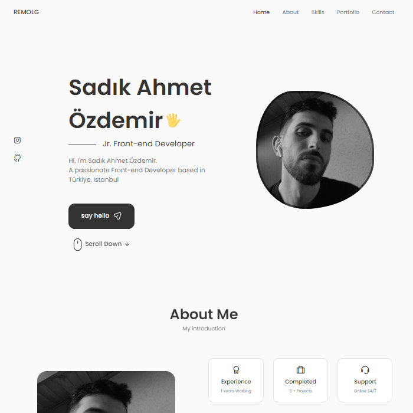

# Portfolio



## Information

This project allows you to get to know me really well and see what I have done and what I know on the software side so far.

## Content

-   Home
-   About
-   Skills
-   Portfolio
-   Contact
## Features

- **Responsive Design**: Optimized for various devices, ensuring accessibility and usability on both desktop and mobile

- **EmailJs**: You can send me an email instantly with "EmailJs"


## Used plugins

- [**EmailJs**](https://www.emailjs.com/)
- [**React Dom**](https://legacy.reactjs.org/docs/react-dom.html)

## How To Use
  
1. Clone the repository:
```bash
git clone https://github.com/remolg/Portfolio.git
```

2. Go to the project folder:
```bash
cd portfolio
```

3. Install the required dependencies:
```bash
npm install
```

4. Start the application:
```bash
npm start
```

5. Visit the address below in your browser:
```bash
http://localhost:3000
```  

## Or You can go by clicking on the link

- [Portfolio](https://remolg-portfolio.netlify.app/)